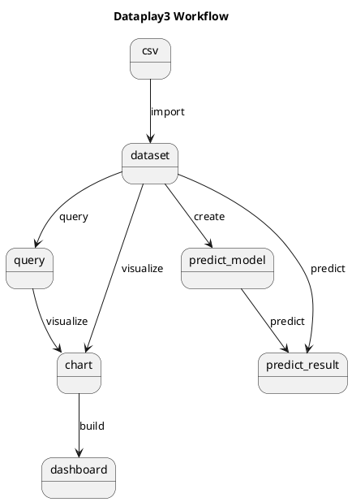

## Dataplay3 Feature Introduction
### workflow

Following diagram shows the basic workflow of dataplay3:
1. prepare your data as csv, import it as dataset
2. you can run query to transform your dataset into a new result
3. you can visualize your dataset or query result using grammar drive data visualiztion or typed chart
4. you can use dataset to build a prediction model, where the target could be a numeric value, a ctagorical value, or time serials related prediction.
5. you can use prediction model to predict using a new dataset




### manage dataset

The first thing you need to do is to have a dateset, with page **dataset -> import data** you can import a csv file or using those sample dataset provided by dataplay3.


Do not forget to click save button to save the dataset in the final step.

With page **dataset -> view**, you can view your current dataset


With page **dataset -> query**, you can run a query to query dataset and save the result for future visualization


the query should be in following grammer:
```
dataset=<dataset_name> type=(sql|query) name=<query_name> | query
```

Two types of query is now supported:
* [pandas dataset query](http://jose-coto.com/query-method-pandas)
* [sql query](https://github.com/yhat/pandasql/) , now a simple sql query is supported, can only support one dataset with `from dataset` as condition.

Here are some query samples:
```
dataset=iris name=query1 type=sql | select sum(sepal_length),sum(sepal_width), species from dataset group by species
dataset=nasdaq name=query1 type=sql | select * from dataset ORDER BY Date Desc Limit 1000
dataset=iris type=query | species == "Iris Setosa"
```
Click `save dataset query` button to save the query result.  `dataset` is required, `type` default to `sql` and `name` is required when you want to save the query result.

With page **dataset -> manage**, you can view/delete your dataset or saved query, also you can export your saved query to a dataset


### dataset visualization

With page **visualizaion -> grammar driven**, you can build a visualiztion using grammer driven data visualization, similar as [tabeau](https://www.tableau.com/) or [ggplot](http://ggplot.yhathq.com/). It is base on [ant g2](https://github.com/antvis/g2), for more information about how that grammer works, refer to [doc](https://antv.alipay.com/zh-cn/g2/3.x/index.html)


You may feel it is hard to use those grammer to build visualization, dataplay provides build-in chart types like `pie`,`bar`,`line`, with grammer of graphics, it is easy to add new type support. refer to [chart config](https://github.com/gangtao/dataplay3/blob/master/client/src/components/Visualization/ChartConfig.js) about how to extend new chart type.


After the visualzation has been build, you can click `export to dashboard` button to save it to dashboard.


Now it is a very simple dashboard with list of visualizations, now drag and drop and other layout support.  You can `maximize` or `delete` specific chart from dashboard.

### make prediction


### configurations

You can manage server side configuration through **configuration**

