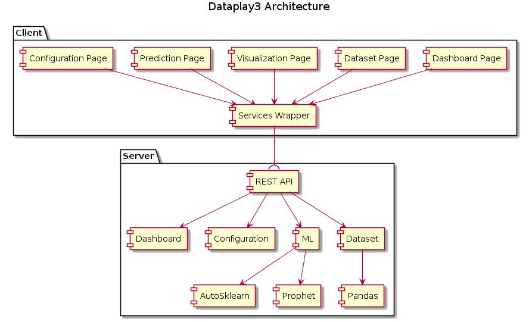

<p align="center">
  <a href="https://github.com/gangtao/dataplay3/issues">
    
  </a>
  <a href="https://github.com/gangtao/dataplay3/network">
    
  </a>
  <a href="https://github.com/gangtao/dataplay3/stargazers">
    
  </a>
  <a href="https://app.codacy.com/app/gangtao/dataplay3?utm_source=github.com&utm_medium=referral&utm_content=gangtao/dataplay3&utm_campaign=Badge_Grade_Settings">
    
  </a>
  <a href="https://ebertapp.io/github/gangtao/dataplay3">
    
  </a>
</p>

<p align="center">
  A small all in one data science tool
</p>

# dataplay3

### Quick Start
To build your own dataplay3 container, run
```bash
make docker
```
and then start the dataplay3 in a container with
```bash
make run
```
open [http://localhost:8000](http://localhost:8000) to access dataplay3 ui.

### Feature Overview

dataplay3 provides following features:
- Dataset management
- Dataset query
- Data visualization
- A Simple dashboard
- Categorical data prediction
- Numerical data prediction
- Time serials data prediction

refer to [feature introduction](/features) for details

### Architecture

Here is a list of what is being used to build dataplay3:

**Client Side**
- [React](https://reactjs.org/) A JavaScript library for building user interfaces
- [Ant Design Pro](https://pro.ant.design/) Out-of-box UI solution for enterprise applications
  - [Ant Design](https://ant.design/) An enterprise-class UI design language and React implementation.
  - [UmiJS](https://umijs.org/) Pluggable enterprise-level react application framework.
  - [Dva](https://github.com/dvajs/dva) Lightweight front-end framework based on redux, redux-saga and react-router
- [BizCharts](https://github.com/alibaba/BizCharts) Powerful data visualization library based on G2 and React
  - [G2](https://github.com/antvis/g2) The Grammar of Graphics in JavaScript

**Server Side**
- [sanic](https://github.com/huge-success/sanic) async python 3.5+ web server
- [pandas](https://pandas.pydata.org/) python data analysis library
- [auto-sklearn](https://automl.github.io/auto-sklearn/master/index.html) an automated machine learning toolkit
- [prophet](https://github.com/facebook/prophet) tool for producing high quality forecasts for time series data that has multiple seasonality with linear or non-linear growth.
- [pandassql](https://github.com/yhat/pandasql/) allows you to query pandas DataFrames using SQL syntax
- [gunicorn](https://gunicorn.org/) a python WSGI HTTP Server for UNIX

Here is a component view of dataplay3


```plantuml
@startuml
swag
title Dataplay3 Architecture

package "Client" {
    [Dashboard Page] as dashboard
    [Dataset Page] as dataset
    [Visualization Page] as viz
    [Prediction Page] as ml
    [Configuration Page] as config
    [Services Wrapper] as services
}


package "Server" {
    [REST API] as api
    [Dashboard]
    [Configuration]
    [ML]
    [Dataset]
    [AutoSklearn]
    [Prophet]
    [Pandas]
}

dashboard -down-> services
dataset -down-> services
viz -down-> services
ml -down-> services
config -down-> services

services -down-( api

api -down-> Dashboard
api -down-> Configuration
api -down-> ML
api -down-> Dataset

ML -down-> AutoSklearn
ML -down-> Prophet

Dataset -down-> Pandas

@enduml
```

### Development

#### Client
Dataplay3 client is based on [ant design pro](https://pro.ant.design/). To build the client, you need have [node](https://nodejs.org/en/) installed.

To develop the client, first install all dependencies.

```bash
cd client
npm install
```
[yarn](https://yarnpkg.com/en/) can be used for dependency management as well.

Start the client
```bash
npm run start
```

To build the client and copy all the output client code to the static directory of the server
```bash
npm run build
```

More client build options refer to `dataplay3/client/package.json`

#### Server
Dataplay3 server is based on Python3 and [Sanic](https://github.com/huge-success/sanic).

To setup server development environment, you need Python3 and pip. It is recommended to using virtual env to manage your python environment.  Run following command to create your python virtual environment.
```bash
python -m venv .venv
source .venv/bin/activate
```

Install development dependency
```bash
cd server
pip3 install -r dev-requirements.txt
```

And then use doit to install all the dependencies for dataplay3 server.
```bash
doit install_dep
```
Depending on your develop operating system, you may need manually install `gcc` and `swig`, refer to these [how to install gcc](https://www.guru99.com/c-gcc-install.html), [how to install swig](https://www.dev2qa.com/how-to-install-swig-on-macos-linux-and-windows/)


To start the dataplay server, run
```bash
doit server
```

To access open api doc, visit [http://localhost:8000/swagger/](http://localhost:8000/swagger/)

for more build options of server, run
```bash
doit list
```
